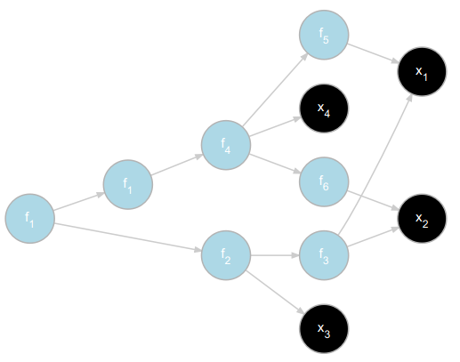

# expRess: Simple Expression Graphs in R

expRess allows you to generate simple expression graphs in R, like the ones you see when reasoning about [autodiff](https://en.wikipedia.org/wiki/Automatic_differentiation) and [backpropagation](https://en.wikipedia.org/wiki/Backpropagation). 

For instance:

```R
expression_graph(f_1(f_2(f_3(x_1, x_2), x_3), f_1(f_4(f_5(x_1), f_6(x_2), x_4)))) %>% 
  DiagrammeR::render_graph()
```

will generate:


